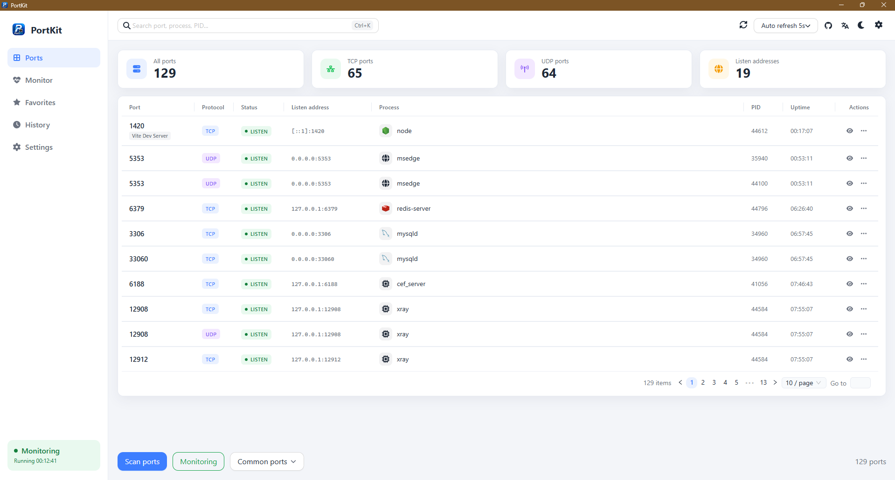
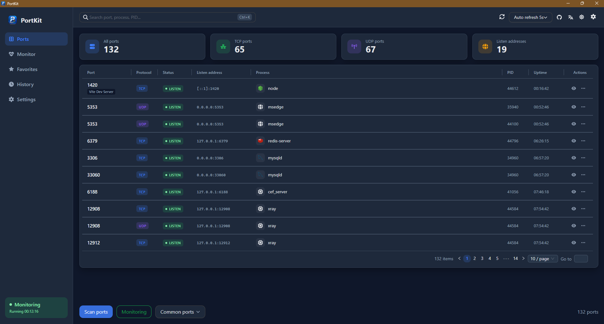
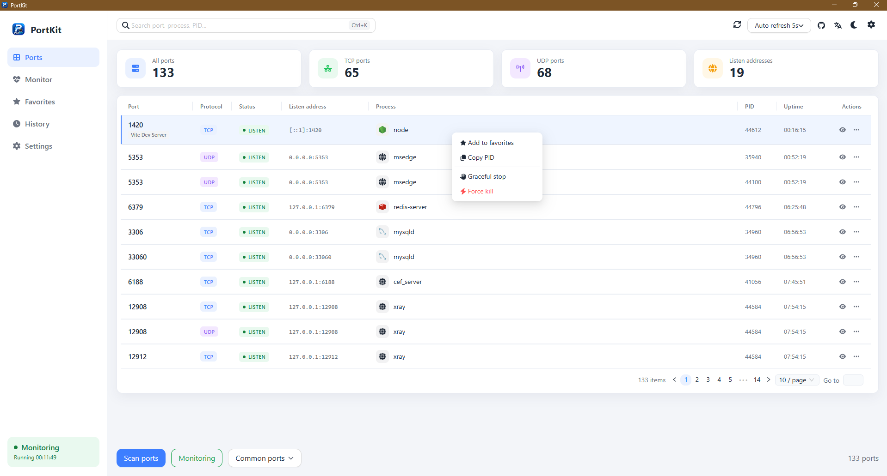
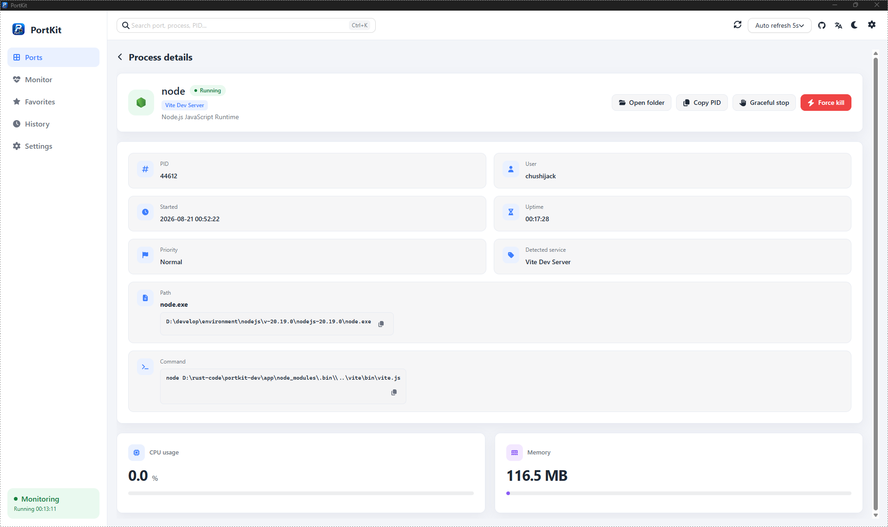
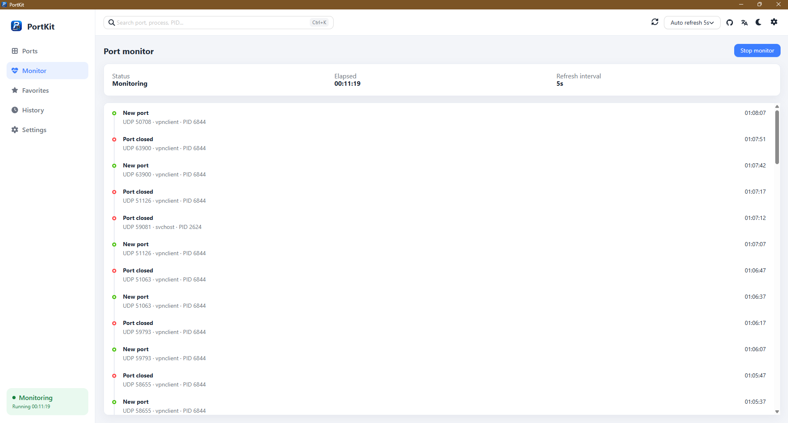
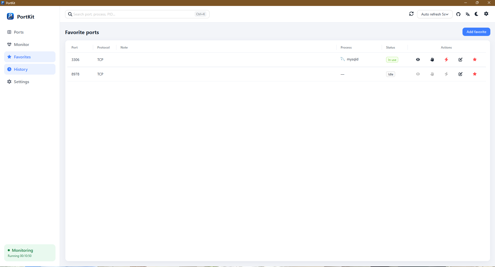
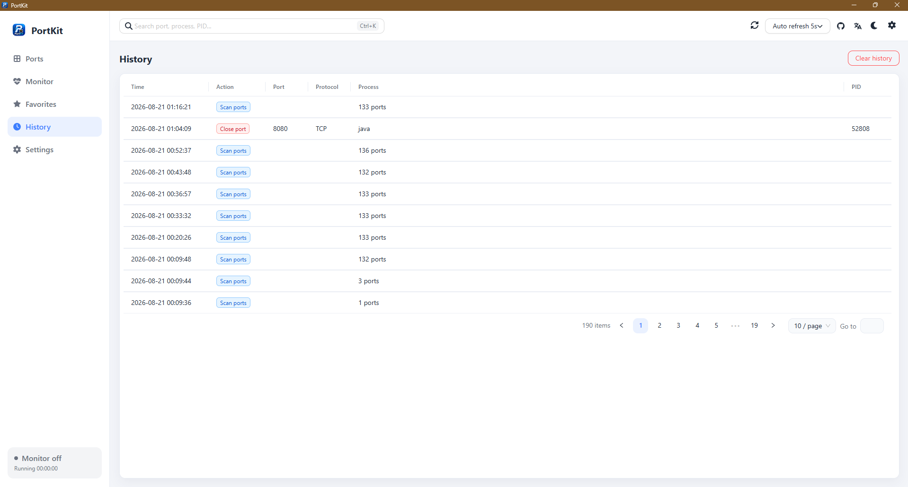

# PortKit

**English** | [简体中文](README.zh-CN.md)

<p align="center">
  
</p>

<p align="center">
  A cross-platform desktop app for managing local ports. See which process holds a port, then release it safely.
</p>

<p align="center">
  Windows · macOS · Tauri 2 · Vue 3
</p>

## What it does

- Scan listening TCP / UDP ports and label common dev services (Vite, Spring, MySQL, Redis, and more)
- Inspect process details: path, startup command, CPU, and memory
- Stop a process gracefully or force-kill it. Windows services, launchd, supervisors, and Docker are handled by controller type
- Watch ports appear and disappear in real time, favorite ports you care about, and keep scan / kill history
- One-click scan of common development ports, with Chinese / English / Japanese and light / dark themes

## Screenshots

### Port list

The main view in light and dark themes: port, protocol, process, uptime, and row actions.

| Light | Dark |
| --- | --- |
|  |  |

The context menu can favorite a port, copy its PID, and choose graceful stop or force kill.



### Process details

Open the occupying process to see its path and command, copy the PID, or stop it from this page.



### Monitor

With live monitoring on, new and closed ports show up on a timeline.



### Favorites

Save ports you use often. Occupied and idle states stay visible.



### History

Look back at scan and port-close actions.



## Development

Requires Node.js 20.19.0 and Rust 1.88.0. Use `.vfox.toml` at the repo root to switch tool versions.

```bash
pnpm install
pnpm tauri dev
```

## Build

```bash
pnpm tauri build
```

Release notes live in `docs/changelog/<tag>/release.json` and are embedded into the app at build time. Each `notes` and `sections[].items` field must include `zh-CN`, `en`, and `ja`.

## Star History

<a href="https://star-history.com/#chushijack/portkit&Date">
  <picture>
    <source media="(prefers-color-scheme: dark)" srcset="https://api.star-history.com/svg?repos=chushijack/portkit&type=Date&theme=dark" />
    <source media="(prefers-color-scheme: light)" srcset="https://api.star-history.com/svg?repos=chushijack/portkit&type=Date" />
    
  </picture>
</a>

## License

Licensed under the [Apache License, Version 2.0](LICENSE).

## Author

[Chushi Jack](https://github.com/chushijack) · [GitHub repository](https://github.com/chushijack/portkit)
