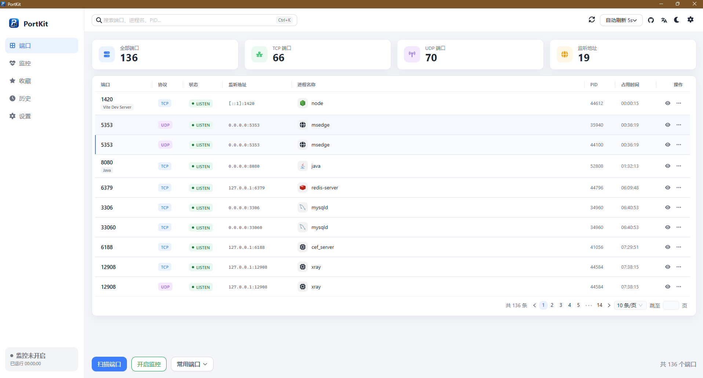
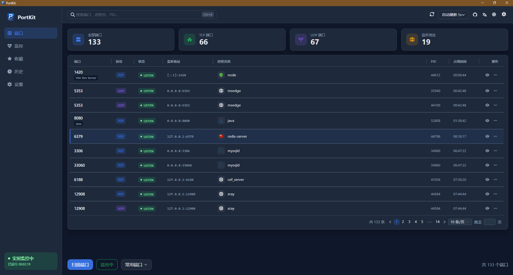
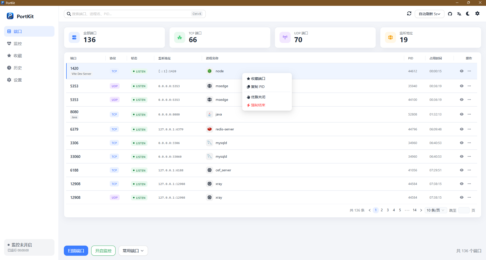
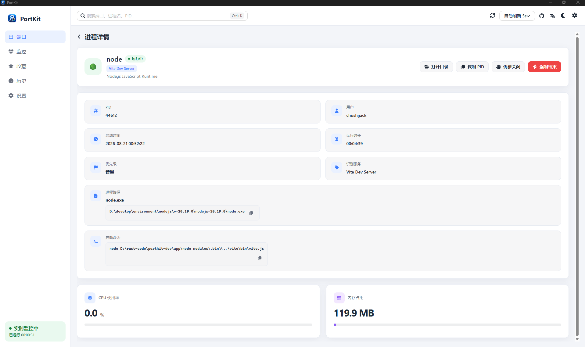
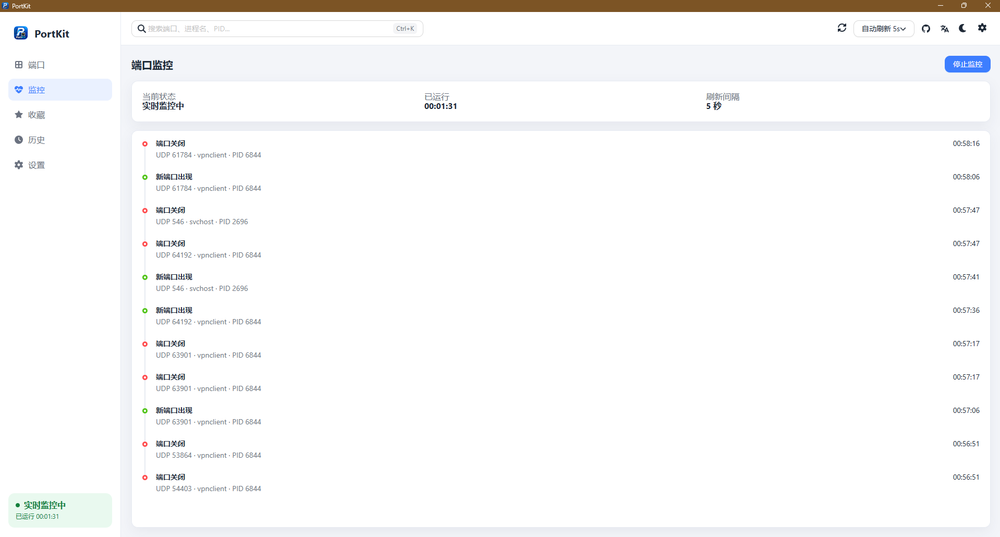
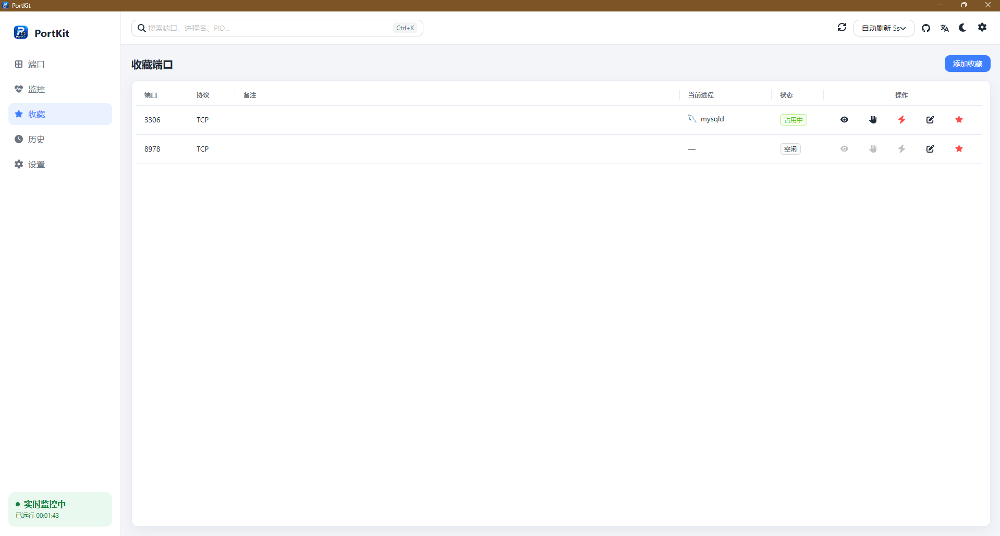
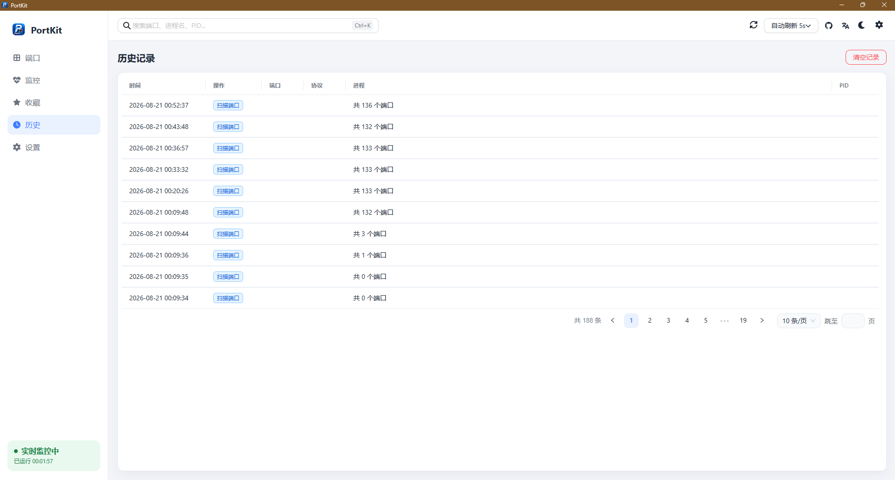

# PortKit

[English](README.md) | **简体中文**

<p align="center">
  
</p>

<p align="center">
  跨平台端口管理桌面应用，帮开发者快速看清本机谁占用了哪个端口，并安全地释放它。
</p>

<p align="center">
  Windows · macOS · Tauri 2 · Vue 3
</p>

## 它能做什么

- 扫描本机 TCP / UDP 监听端口，识别常见开发服务（Vite、Spring、MySQL、Redis 等）
- 查看进程详情：路径、启动命令、CPU、内存
- 优雅关闭或强制结束占用端口的进程；系统服务、守护程序、Docker 会按控制者分别处理
- 实时监控端口增减，收藏常用端口，保留扫描与关闭历史
- 常用开发端口一键扫描，支持中 / 英 / 日与浅色 / 深色主题

## 界面预览

### 端口列表

浅色与深色下的主界面：端口、协议、进程、占用时长，以及行内操作。

| 浅色 | 深色 |
| --- | --- |
|  |  |

右键菜单可收藏、复制 PID，并选择优雅关闭或强制结束。



### 进程详情

打开占用进程后，可查看路径与启动命令，复制 PID，或从这里结束进程。



### 监控

开启实时监控后，端口新增、关闭会记在时间线里。



### 收藏

把常用端口存下来，空闲或占用状态一目了然。



### 历史

扫描与关闭端口的操作记录可以事后回看。



## 开发

需要 Node.js 20.19.0 与 Rust 1.88.0，可用仓库根目录 `.vfox.toml` 切换版本。

```bash
pnpm install
pnpm tauri dev
```

## 构建

```bash
pnpm tauri build
```

更新日志源数据位于 `docs/changelog/<tag>/release.json`，桌面端编译时内嵌。`notes` 与 `sections[].items` 均需维护 `zh-CN`、`en`、`ja` 三语内容。

## Star History

<a href="https://star-history.com/#chushijack/portkit&Date">
  <picture>
    <source media="(prefers-color-scheme: dark)" srcset="https://api.star-history.com/svg?repos=chushijack/portkit&type=Date&theme=dark" />
    <source media="(prefers-color-scheme: light)" srcset="https://api.star-history.com/svg?repos=chushijack/portkit&type=Date" />
    
  </picture>
</a>

## 许可证

本项目采用 [Apache License 2.0](LICENSE) 开源协议。

## 作者

[Chushi Jack](https://github.com/chushijack) · [GitHub 仓库](https://github.com/chushijack/portkit)
